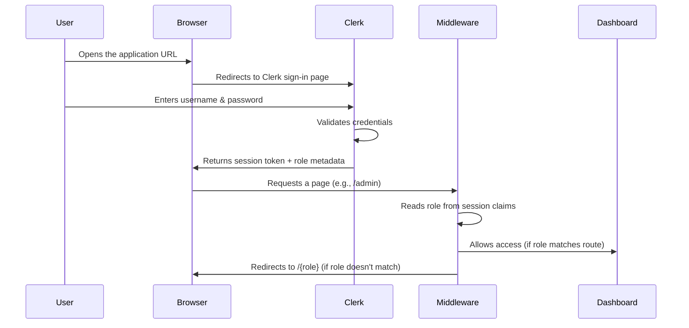
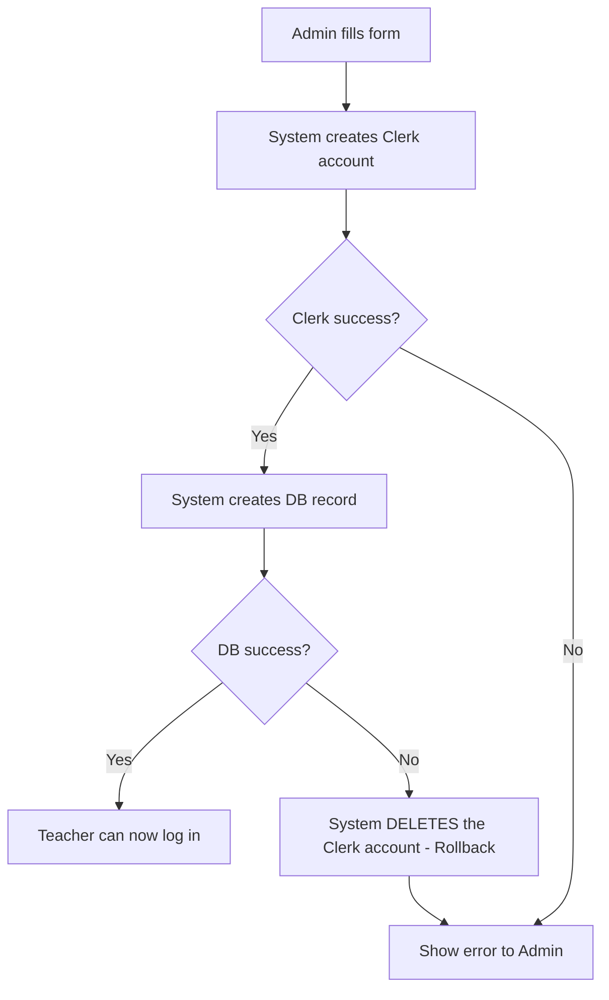
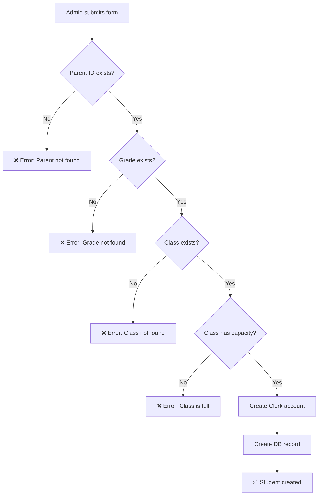
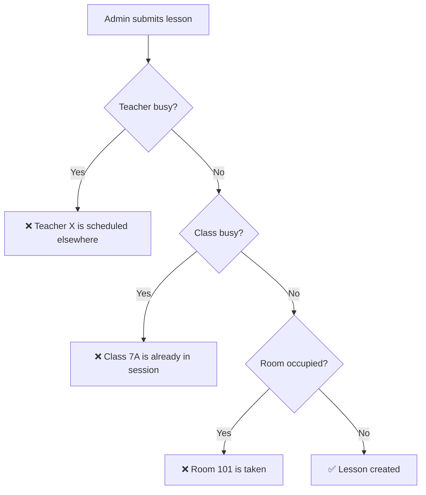
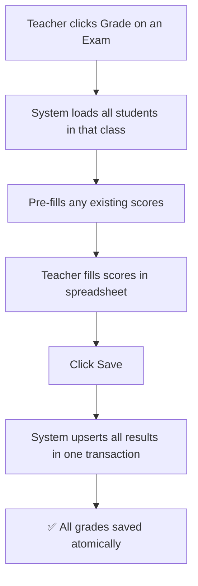
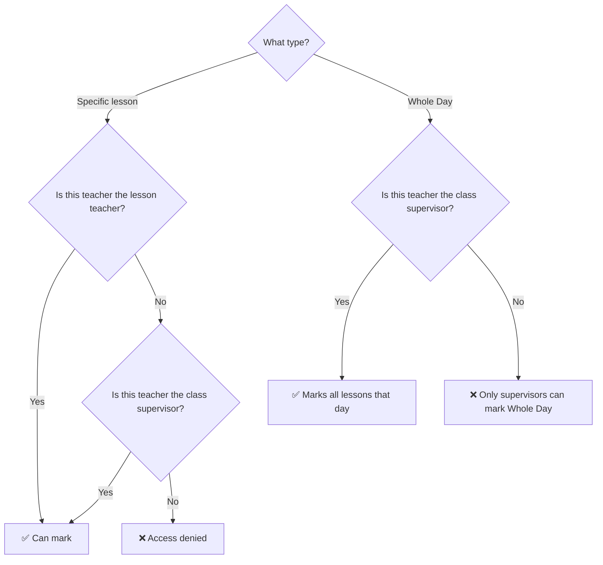
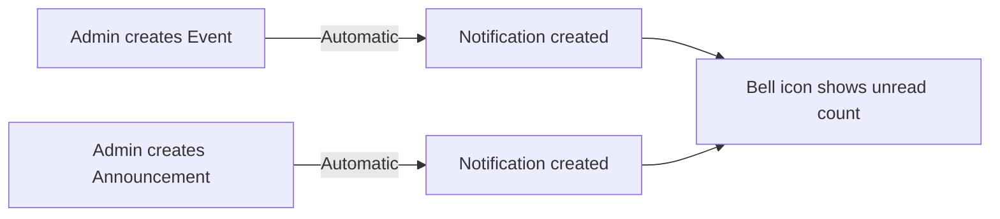

# 📘 Bookish-Spork — Complete Application Logic Flow

> **Purpose:** This document explains how every part of the school management system works — who can do what, when, where, and how each action affects other parts of the system. Written for non-technical readers.

---

## Table of Contents

1. [How Login Works](#1-how-login-works)
2. [The Four Roles](#2-the-four-roles)
3. [Route Protection — Who Can Access What](#3-route-protection)
4. [The Sidebar Menu](#4-the-sidebar-menu)
5. [Entity Relationship Map — How Data Connects](#5-entity-relationship-map)
6. [Feature-by-Feature Logic Flows](#6-feature-by-feature-logic-flows)
   - [Grades](#61-grades)
   - [Subjects](#62-subjects)
   - [Teachers](#63-teachers)
   - [Parents](#64-parents)
   - [Students](#65-students)
   - [Classes](#66-classes)
   - [Lessons (Timetable)](#67-lessons)
   - [Exams](#68-exams)
   - [Assignments](#69-assignments)
   - [Results & Grading](#610-results--grading)
   - [Attendance](#611-attendance)
   - [Events](#612-events)
   - [Announcements](#613-announcements)
   - [Notifications](#614-notifications)
7. [Dashboard Views per Role](#7-dashboard-views-per-role)
8. [Automated System Behaviors](#8-automated-system-behaviors)

---

## 1. How Login Works



**How it works:**
- The system uses **Clerk** as its authentication provider. Clerk manages all usernames, passwords, and sessions.
- When a user is created (Teacher, Student, or Parent), two things happen simultaneously:
  1. A **Clerk user account** is created (for login credentials)
  2. A **database record** is created (for school data like class, grade, etc.)
- The user's **role** (admin, teacher, student, parent) is stored in Clerk's `publicMetadata`.
- After login, every page request passes through a **middleware gatekeeper** that checks if the user's role is allowed to access that page.

---

## 2. The Four Roles

| Role | Who They Are | What They Can Do |
|------|-------------|------------------|
| **Admin** | School administrators | Full CRUD on everything. See all data. Manage all users. |
| **Teacher** | Instructors | Manage their own lessons, exams, assignments, results, and attendance. View students and parents. |
| **Student** | Enrolled students | View their own schedule, results, attendance, events, and announcements. |
| **Parent** | Guardians of students | View their children's schedules, results, attendance, events, and announcements. Switch between children. |

---

## 3. Route Protection

Every URL in the application is protected by role. If a user tries to access a page they shouldn't, the system **automatically redirects** them to their own dashboard.

| Page | Admin | Teacher | Student | Parent |
|------|:-----:|:-------:|:-------:|:------:|
| `/admin` dashboard | ✅ | ❌ | ❌ | ❌ |
| `/teacher` dashboard | ❌ | ✅ | ❌ | ❌ |
| `/student` dashboard | ❌ | ❌ | ✅ | ❌ |
| `/parent` dashboard | ❌ | ❌ | ❌ | ✅ |
| `/list/teachers` | ✅ | ✅ | ❌ | ❌ |
| `/list/students` | ✅ | ✅ | ❌ | ❌ |
| `/list/parents` | ✅ | ✅ | ❌ | ❌ |
| `/list/subjects` | ✅ | ❌ | ❌ | ❌ |
| `/list/classes` | ✅ | ✅ | ❌ | ❌ |
| `/list/exams` | ✅ | ✅ | ✅ | ✅ |
| `/list/assignments` | ✅ | ✅ | ✅ | ✅ |
| `/list/results` | ✅ | ✅ | ✅ | ✅ |
| `/list/attendance` | ✅ | ✅ | ✅ | ✅ |
| `/list/events` | ✅ | ✅ | ✅ | ✅ |
| `/list/announcements` | ✅ | ✅ | ✅ | ✅ |

---

## 4. The Sidebar Menu

The sidebar dynamically shows or hides links based on the logged-in user's role:

- **All roles** see: Home, Exams, Assignments, Results, Attendance, Events, Messages, Announcements, Profile, Settings, Logout
- **Admin + Teacher** additionally see: Teachers, Students, Parents, Classes, Lessons
- **Admin only** sees: Subjects

---

## 5. Entity Relationship Map

```mermaid
erDiagram
    Grade ||--o{ Class : "has many"
    Grade ||--o{ Student : "has many"
    Class ||--o{ Student : "has many"
    Class ||--o{ Lesson : "has many"
    Class ||--o{ Event : "may target"
    Class ||--o{ Announcement : "may target"
    Class ||--o{ Notification : "may target"
    Class }o--|| Teacher : "supervised by"
    Teacher ||--o{ Lesson : "teaches"
    Teacher ||--o{ Attendance : "marks"
    Teacher }o--o{ Subject : "qualified for"
    Subject ||--o{ Lesson : "taught in"
    Parent ||--o{ Student : "guardian of"
    Lesson ||--o{ Exam : "has"
    Lesson ||--o{ Assignment : "has"
    Lesson ||--o{ Attendance : "tracked in"
    Exam ||--o{ Result : "produces"
    Assignment ||--o{ Result : "produces"
    Student ||--o{ Result : "receives"
    Student ||--o{ Attendance : "tracked"
    Class ||--o{ ClassTeacherAssignment : "curriculum"
    Teacher ||--o{ ClassTeacherAssignment : "assigned to"
    Subject ||--o{ ClassTeacherAssignment : "part of"
    Notification ||--o{ NotificationRead : "read by"
```

**Key Relationships (in plain English):**
- A **Grade** (e.g. Grade 7) has multiple **Classes** (e.g. 7A, 7B)
- A **Class** has multiple **Students** and multiple **Lessons**
- A **Teacher** teaches multiple **Lessons** and can supervise one **Class**
- A **Lesson** belongs to one **Subject**, one **Class**, and one **Teacher**
- **Exams** and **Assignments** belong to a **Lesson**
- **Results** link a **Student** to either an **Exam** or **Assignment** with a score
- **Attendance** tracks a **Student** in a **Lesson** on a specific date
- **Events** and **Announcements** can target: Everyone (general), a specific Class, a specific Teacher, or a specific Student
- **Notifications** are auto-generated when Events/Announcements are created

---

## 6. Feature-by-Feature Logic Flows

### 6.1 Grades

| Action | Who | How |
|--------|-----|-----|
| View grades | Admin | Visible through Class and Student management |
| Create/Edit | System-managed | Pre-seeded in database (Grade 1 through Grade 12) |

**Effect on other entities:** Grades connect to Classes and Students. When creating a Student, you must assign them to a Grade.

---

### 6.2 Subjects

| Action | Who | How |
|--------|-----|-----|
| View | Admin | `/list/subjects` |
| Create | Admin | Click ➕, enter subject name, assign qualified teachers |
| Update | Admin | Click ✏️, modify name or teacher assignments |
| Delete | Admin | Click 🗑️ to remove |

**What happens when you create a Subject:**
1. The subject name is saved to the database
2. Selected teachers are **linked** to this subject (many-to-many)
3. These teacher-subject links are used later when creating Lessons and Classes

**What happens when you update a Subject:**
- All previous teacher links are **replaced** with the new selection (not appended)

---

### 6.3 Teachers

| Action | Who | How |
|--------|-----|-----|
| View list | Admin, Teacher | `/list/teachers` |
| Create | Admin | Click ➕, fill all personal details + password + subject specializations |
| Update | Admin | Click ✏️, modify details (password change optional) |
| Delete | Admin | Click 🗑️ |

**What happens when you create a Teacher:**



1. **Clerk account** is created first (username, password, role: "teacher")
2. **Database record** is created with personal details + subject links
3. If step 2 fails, **step 1 is automatically rolled back** (the Clerk account is deleted) to prevent orphan accounts
4. The new teacher can immediately log in

**What happens when you delete a Teacher:**
1. The Clerk user account is deleted (they can no longer log in)
2. The database record is removed
3. ⚠️ All lessons, exams, assignments, and results associated with this teacher may be affected

---

### 6.4 Parents

| Action | Who | How |
|--------|-----|-----|
| View list | Admin, Teacher | `/list/parents` |
| Create | Admin | Click ➕, fill details + password |
| Update | Admin | Click ✏️ |
| Delete | Admin | Click 🗑️ |

**Logic:** Identical to Teacher creation — dual sync between Clerk and database with automatic rollback on failure.

**Important:** A Parent must be created **before** their child (Student), because the Student form requires a valid Parent ID.

---

### 6.5 Students

| Action | Who | How |
|--------|-----|-----|
| View list | Admin, Teacher | `/list/students` |
| Create | Admin | Click ➕, fill details + select Parent, Grade, and Class |
| Update | Admin | Click ✏️ |
| Delete | Admin | Click 🗑️ |

**What the system checks BEFORE creating a Student:**



**Pre-creation order of operations (CRITICAL):**
1. ✅ Parent must exist first
2. ✅ Grade must exist
3. ✅ Class must exist AND have available capacity
4. Then Clerk + DB dual-sync with rollback

---

### 6.6 Classes

| Action | Who | How |
|--------|-----|-----|
| View list | Admin, Teacher | `/list/classes` |
| Create | Admin | Click ➕, enter name, capacity, grade, supervisor, and curriculum |
| Update | Admin | Click ✏️ |
| Delete | Admin | Click 🗑️ |

**Curriculum System (Multi-Tenant):**
When creating or updating a Class, the Admin can assign a **curriculum** — a list of Subject → Teacher pairs:

| Subject | Teacher |
|---------|---------|
| Mathematics | Mr. Smith |
| English | Ms. Jones |
| Science | Mr. Patel |

**Rules:**
- One subject can only have **one teacher per class** (enforced by database constraint)
- When updating, the old curriculum is **completely replaced** with the new one
- The teacher dropdown only shows teachers **qualified** for the selected subject

---

### 6.7 Lessons (Timetable)

| Action | Who | How |
|--------|-----|-----|
| View list | Admin, Teacher | `/list/lessons` |
| Create | Admin | Click ➕, select day, times, subject, class, teacher, room |
| Update | Admin | Click ✏️ |
| Delete | Admin | Click 🗑️ |

**Conflict Detection Matrix:**
Before creating or updating a lesson, the system checks for three types of conflicts:



**What happens when you delete a Lesson (Cascade Cleanup):**
1. All **attendance records** for this lesson are deleted
2. All **results** linked to this lesson's exams and assignments are deleted
3. All **assignments** for this lesson are deleted
4. All **exams** for this lesson are deleted
5. The lesson itself is deleted
6. Everything happens in a single **transaction** (all-or-nothing)

**School Days:** Monday through Saturday. Sunday is not supported.

---

### 6.8 Exams

| Action | Who | How |
|--------|-----|-----|
| View list | All roles | `/list/exams` |
| Create | Admin, Teacher | Click ➕, select lesson, enter title and times |
| Update | Admin, Teacher | Click ✏️ |
| Delete | Admin, Teacher | Click 🗑️ |

**Teacher ownership rule:** A Teacher can only create/update/delete exams for **their own lessons**. Admin can manage all exams.

**What students/parents see:** A read-only list of exams for lessons in their class.

---

### 6.9 Assignments

| Action | Who | How |
|--------|-----|-----|
| View list | All roles | `/list/assignments` |
| Create | Admin, Teacher | Click ➕, select lesson, enter title, start date, due date |
| Update | Admin, Teacher | Click ✏️ |
| Delete | Admin, Teacher | Click 🗑️ |

**Same ownership rules as Exams.**

---

### 6.10 Results & Grading

| Action | Who | How |
|--------|-----|-----|
| View list | All roles | `/list/results` |
| Create (individual) | Admin, Teacher | Via form modal |
| Bulk grade | Admin, Teacher | Click "Grade" icon on an Exam or Assignment row → Spreadsheet editor |
| Update | Admin, Teacher | Click ✏️ |
| Delete | Admin, Teacher | Click 🗑️ |

**How Results connect to things:**
- Each Result links to: **one Student** + either **one Exam OR one Assignment** (never both)
- A Result includes a **score** (number) and optional **feedback** (text)

**Bulk Grading Flow:**



**What Students see:** A "Report Card" view grouped by Subject, showing all their exam and assignment scores.

**What Teachers/Admin see:** A "Gradebook" view that requires selecting a Class + Subject first, then shows a filtered table.

---

### 6.11 Attendance

| Action | Who | How |
|--------|-----|-----|
| View (staff) | Admin, Teacher | `/list/attendance` → Spreadsheet mode |
| View (consumer) | Student, Parent | `/list/attendance` → Analytics dashboard |
| Mark attendance | Admin, Teacher | Select class, date, (optionally lesson) → Mark each student |
| Submit absence note | Parent, Admin | Upload document for an ABSENT record |

**Teacher Access Rules:**



**Conflict Resolution (Whole Day vs. Specific Lesson):**
- If a **subject teacher** marks attendance for their specific lesson, and later the **class supervisor** marks "Whole Day":
  - The existing specific teacher's mark is **preserved** (not overwritten)
  - Unless the supervisor explicitly enables "Force Override"

**48-Hour Lock:**
- Once an attendance record is saved, it **cannot be edited after 48 hours**
- The UI shows a 🔒 icon on locked records

**Statuses:** PRESENT, ABSENT, LATE (with minutes tracking), EXCUSED (after parent submits note), HALF_DAY

**What Students/Parents see:**
- A circular **Engagement Score** (attendance percentage)
- A **Risk Badge** if attendance drops below 85%
- A **14-day heatmap** showing recent attendance patterns
- An "Upload Medical Note" button for absent records

---

### 6.12 Events

| Action | Who | How |
|--------|-----|-----|
| View list page | All roles | `/list/events` |
| View on calendar | All roles | Dashboard sidebar calendar |
| Create | Admin | Click ➕, enter title, description, start/end times, and target |
| Update | Admin | Click ✏️ |
| Delete | Admin | Click 🗑️ |

**Targeting System:**
When creating an Event, the Admin can choose who sees it:

| Target | Who Sees It |
|--------|------------|
| General (no target) | Everyone — all students, teachers, parents |
| Class (e.g., Class 7A) | All students in 7A + their parents + teachers who teach 7A |
| Specific Teacher | Only that teacher |
| Specific Student | Only that student + their parent |

**Automatic Side Effect:** When an Event is created, a **Notification** is automatically generated with the same targeting, so users see it in their notification bell.

---

### 6.13 Announcements

| Action | Who | How |
|--------|-----|-----|
| View list page | All roles | `/list/announcements` |
| View on dashboard | All roles | Dashboard sidebar |
| Create | Admin | Click ➕ |
| Update | Admin | Click ✏️ |
| Delete | Admin | Click 🗑️ |

**Same targeting system and notification emission as Events.**

---

### 6.14 Notifications

| Action | Who | How |
|--------|-----|-----|
| View | All roles | Click the 🔔 bell icon in the top navbar |
| Mark as read | All roles | Click on an unread notification |
| Mark all as read | All roles | Click "Mark all read" button |

**How Notifications are generated (automatic):**



**Visibility Rules (same as Events/Announcements):**
- **Admin:** Sees all notifications
- **Teacher:** Sees general notifications + those targeting them directly + those targeting classes they teach
- **Student:** Sees general notifications + those targeting them directly + those targeting their class
- **Parent:** Sees general notifications + those targeting their children + those targeting their children's classes

**Hover Tooltip:** When hovering over a notification in the panel, a compact white tooltip appears to the left showing the first 80 characters of the description.

**Categories:** Each notification is color-coded by type:
- 📢 Announcement (Purple)
- 📅 Event (Blue)
- 📝 Exam (Orange)
- 📋 Assignment (Green)
- 🏆 Result (Teal)

---

## 7. Dashboard Views per Role

### Admin Dashboard
| Section | What It Shows |
|---------|--------------|
| **User Cards** | Total counts: Students, Teachers, Parents, Admins |
| **Count Chart** | Real-time gender-based attendance gauge (Boys Present / Girls Present / Absent) |
| **Attendance Chart** | Weekly attendance trends |
| **Finance Chart** | Revenue overview |
| **Event Calendar** | Clickable calendar → shows events for selected date |
| **Announcements** | Recent announcements widget |
| **Notification Bell** | All notifications with unread badge |

### Teacher Dashboard
| Section | What It Shows |
|---------|--------------|
| **Schedule** | Full weekly BigCalendar showing only this teacher's lessons |
| **Event Calendar** | Events visible to this teacher |
| **Announcements** | Announcements visible to this teacher |
| **Notification Bell** | Notifications targeting this teacher or their classes |

### Student Dashboard
| Section | What It Shows |
|---------|--------------|
| **Schedule** | Full weekly BigCalendar showing this student's class timetable |
| **Event Calendar** | Events targeting this student's class or them specifically |
| **Announcements** | Announcements for their class |
| **Notification Bell** | Class + personal notifications |

### Parent Dashboard
| Section | What It Shows |
|---------|--------------|
| **Child Switcher** | Dropdown to switch between children (if parent has multiple) |
| **Schedule** | BigCalendar for the active child's class |
| **Event Calendar** | Events for the active child's class |
| **Announcements** | Announcements for the active child's class |
| **Notification Bell** | Notifications for all children's classes |

---

## 8. Automated System Behaviors

These things happen **automatically** without user intervention:

| Behavior | When It Triggers | What It Does |
|----------|-----------------|-------------|
| **Clerk-DB Rollback** | Teacher/Student/Parent creation fails at database step | Automatically deletes the Clerk account to prevent orphan logins |
| **Class Capacity Check** | Student creation | Blocks enrollment if class is already full |
| **FK Pre-Validation** | Student creation | Verifies that the selected Parent, Grade, and Class all exist before proceeding |
| **Lesson Conflict Matrix** | Lesson create/update | Checks for Teacher, Class, and Room scheduling conflicts |
| **48-Hour Lock** | Attendance edit attempt | Prevents modifications to records older than 48 hours |
| **Attendance Conflict Resolution** | Whole Day marking | Preserves individual teacher marks unless supervisor forces override |
| **Notification Emission** | Event or Announcement creation | Automatically creates a Notification record with matching targeting |
| **Cascade Delete** | Lesson deletion | Removes all attendances, results, assignments, and exams in a single transaction |
| **Curriculum Rebuild** | Class update | Wipes old subject-teacher assignments and rebuilds with new ones |
| **Role-Based Routing** | Every page request | Middleware checks session role → redirects unauthorized users |
| **Dynamic Menu** | Page load | Sidebar links appear/disappear based on user role |
| **Path Revalidation** | After any CRUD operation | Next.js cache is cleared for affected pages so data refreshes |

---

> **Last Updated:** March 22, 2026
> **Generated from:** Full codebase audit of Prisma schema, 1651-line actions.ts, middleware.ts, settings.ts, Menu.tsx, all 4 role dashboards, and all form components.
